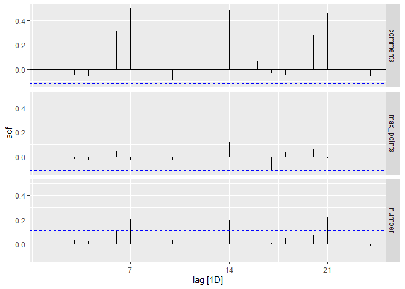
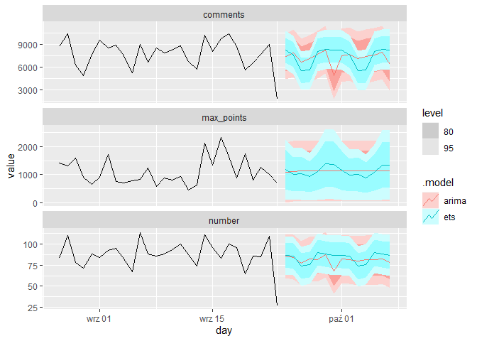

WhyR Hackaton - Challenge 1
================
MeanGuys

``` r

knitr::opts_chunk$set(results = "hold", message = FALSE, strip.white = TRUE, warning = FALSE)

load_ibraries <- c("tidyverse", "rvest", "jsonlite", "tidyjson", "lubridate", 
                   "magrittr", "hackeRnews", "R.utils", "tsibble","feasts", "fable")
installed_libraries <- load_ibraries[!load_ibraries %in% installed.packages()]

for(lib in installed_libraries) 
    install.packages(lib, dependences = TRUE)

sapply(load_ibraries, require, character = TRUE)
##  tidyverse      rvest   jsonlite   tidyjson  lubridate   magrittr hackeRnews 
##       TRUE       TRUE       TRUE       TRUE       TRUE       TRUE       TRUE 
##    R.utils    tsibble     feasts      fable 
##       TRUE       TRUE       TRUE       TRUE
```

``` r
capwords <- function(s, strict = FALSE) 
{
    cap <- function(s) paste(toupper(substring(s, 1, 1)),
                  {s <- substring(s, 2); if(strict) tolower(s) else s},
                             sep = "", collapse = " " )
    sapply(strsplit(s, split = " "), cap, USE.NAMES = !is.null(names(s)))
}
```

``` r
articles <- fromJSON(readLines("../data/articles.json"), flatten = TRUE)
articles_df <- as_tibble(lapply(select(articles, -kids, -title, -id, -type), as.character))

articles_df %<>% rename(comments = descendants)
```

``` r
compDay <- ymd_hm("2020-09-25 00:00")
compWeekday <- wday(compDay, 
                    week_start = getOption("lubridate.week.start", 1),
                    locale = "English",
                    label = TRUE)
```

``` r
str(articles_df)
```

    ## tibble [25,577 x 5] (S3: tbl_df/tbl/data.frame)
    ##  $ by      : chr [1:25577] "todsacerdoti" "themodelplumber" "luu" "pseudolus" ...
    ##  $ comments: chr [1:25577] "607" "126" "27" "56" ...
    ##  $ score   : chr [1:25577] "711" "310" "227" "94" ...
    ##  $ time    : chr [1:25577] "2020-09-23 08:38:33" "2020-09-23 06:04:45" "2020-09-22 13:04:22" "2020-09-22 13:47:02" ...
    ##  $ url     : chr [1:25577] "http://calpaterson.com/mozilla.html" "https://www.npr.org/2020/09/15/913207918/how-to-say-no-for-the-people-pleaser-who-always-says-yes" "https://scattered-thoughts.net/writing/small-tech/" "https://literaryreview.co.uk/tawk-of-the-town" ...

``` r
articles_df$comments %<>% as.integer()
articles_df$score    %<>% as.integer() 
articles_df$time     %<>% ymd_hms()
articles_df$by       %<>% factor()
```

``` r
articles_df %<>%
    mutate(weekday = wday(time, 
                          week_start = getOption("lubridate.week.start", 1),
                          locale = "English",
                          label = TRUE),
           day = day(time),
           month = month(time, 
                         locale = "English",
                         label = TRUE),
           main_url = str_match(url, "(https?://w{0,3}\\.?)(.*?)(\\.[A-z]*/|$)")[,3]) %>%
  mutate(comp_day = (weekday == compWeekday))

articles_df %>%
  transmute(comments = comments, score = score, day = date(time)) %>%
  group_by(day) %>%
  summarise(max_points = max(score),
            comments = mean(comments),
            score = mean(score)) %>%
  pivot_longer(!day) %>%
  mutate(comp_day = (wday(compDay) == wday(day))) %>%
  as_tsibble(index = day, key = name)-> articles_summarized
  
head(articles_df)
```

    ## # A tibble: 6 x 10
    ##   by    comments score time                url   weekday   day month main_url
    ##   <fct>    <int> <int> <dttm>              <chr> <ord>   <int> <ord> <chr>   
    ## 1 tods~      607   711 2020-09-23 08:38:33 http~ Wed        23 Sep   calpate~
    ## 2 them~      126   310 2020-09-23 06:04:45 http~ Wed        23 Sep   npr     
    ## 3 luu         27   227 2020-09-22 13:04:22 http~ Tue        22 Sep   scatter~
    ## 4 pseu~       56    94 2020-09-22 13:47:02 http~ Tue        22 Sep   literar~
    ## 5 jean~       24    87 2020-09-23 01:13:58 http~ Wed        23 Sep   akitaso~
    ## 6 beag~       13    58 2020-09-22 22:17:38 http~ Tue        22 Sep   beyondl~
    ## # ... with 1 more variable: comp_day <lgl>

``` r
c("comments", "score") %>%
    sapply(
        function(X)
        {
            ggplot(articles_df) +
            geom_histogram(aes(x = get(X)),
                           alpha = 0.5) +
            labs(x = capwords(X),
                 y = "Count",
                 title = "Interaction distribution") +
            scale_x_log10()
        },
        simplify = FALSE,
        USE.NAMES = TRUE
    ) -> histograms

histograms
```

<!-- --><!-- -->

    ## $comments
    ## 
    ## $score

``` r
c("comments", "score") %>%
    sapply(
        function(X)
        {
            articles_df %>%
            # filter(weekday == compWeekday) %>%
            ggplot() +
            geom_histogram(aes(x = get(X),
                               y = ..density..,
                               fill = comp_day),
                           alpha = 0.5,
                           ) +
            labs(x = capwords(X),
                 y = "Density",
                 title = "Interaction distribution") +
            guides(fill = "none") +
            scale_x_log10() +
            facet_grid(.~comp_day,
                       labeller = label_both)
        },
        simplify = FALSE,
        USE.NAMES = TRUE
    ) -> compHistograms

compHistograms
```

<!-- --><!-- -->

    ## $comments
    ## 
    ## $score

``` r
articles_summarized %>%
  filter(name != "max_points") %>%
  autoplot()
```

<!-- -->

``` r
articles_summarized %>%
  filter(name == "max_points") %>%
  autoplot()
```

<!-- -->

``` r
articles_summarized %>%
  ACF() %>% 
  autoplot()
```

<!-- -->

``` r
articles_summarized %>%
  select(-comp_day) %>%
  group_by(name) %>%
  model(ets = ETS(value),
        arima = ARIMA(value)) -> ts_models

ts_models %>%
  accuracy()

# ts_models %>%
#   augment()

forecast(ts_models, h = "14 days") -> fits

fits %>%
  autoplot(articles_summarized %>%
             filter(day > today()-30))
```

<!-- -->

    ## # A tibble: 6 x 10
    ##   name       .model .type         ME  RMSE    MAE    MPE  MAPE  MASE     ACF1
    ##   <chr>      <chr>  <chr>      <dbl> <dbl>  <dbl>  <dbl> <dbl> <dbl>    <dbl>
    ## 1 comments   ets    Training   0.375  11.8   9.26  -1.30 10.9  0.702  0.109  
    ## 2 comments   arima  Training   0.816  13.2  10.4   -1.23 12.3  0.789  0.0104 
    ## 3 max_points ets    Training -28.5   548.  409.   -20.0  40.8  0.729  0.136  
    ## 4 max_points arima  Training   0.397 547.  401.   -20.4  40.4  0.714  0.00238
    ## 5 score      ets    Training  -1.02   19.1  14.7   -2.17  9.89 0.689  0.0980 
    ## 6 score      arima  Training   0.514  21.0  16.2   -1.58 10.8  0.757 -0.00540

``` r
bind_rows(fits %>%
            filter(day == compDay) %>%
            as_tibble() %>%
            select(-value, -day) %>%
            rename_with(~ gsub(".", "", .x, fixed = TRUE), starts_with(".")),
          articles_summarized %>%
            as_tibble() %>%
            group_by(name, comp_day) %>%
            summarise(mean = mean(value)) %>%
            filter(comp_day) %>%
            select(-comp_day) %>%
            mutate(model = "comp_day_mean"),
          articles_summarized %>%
            as_tibble() %>%
            group_by(name) %>%
            select(-comp_day) %>%
            summarise(mean = mean(value)) %>%
            mutate(model = "day_mean")) %>%
  arrange(model, name) -> results

print(results)
```

    ## # A tibble: 12 x 3
    ##    name       model           mean
    ##    <chr>      <chr>          <dbl>
    ##  1 comments   arima           91.2
    ##  2 max_points arima         1124. 
    ##  3 score      arima          143. 
    ##  4 comments   comp_day_mean   88.6
    ##  5 max_points comp_day_mean 1007. 
    ##  6 score      comp_day_mean  152. 
    ##  7 comments   day_mean        85.9
    ##  8 max_points day_mean      1131. 
    ##  9 score      day_mean       153. 
    ## 10 comments   ets             89.4
    ## 11 max_points ets           1020. 
    ## 12 score      ets            139.

``` r
results %>%
  filter(model == "ets") %>%
  select(-model) -> final_predictions
  
print(final_predictions)

write.csv(final_predictions,
          "../deliverables/MeanGuys_prediction_challenge_1.csv",
          row.names = FALSE)
```

    ## # A tibble: 3 x 2
    ##   name         mean
    ##   <chr>       <dbl>
    ## 1 comments     89.4
    ## 2 max_points 1020. 
    ## 3 score       139.
